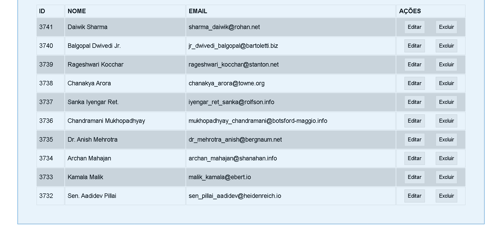
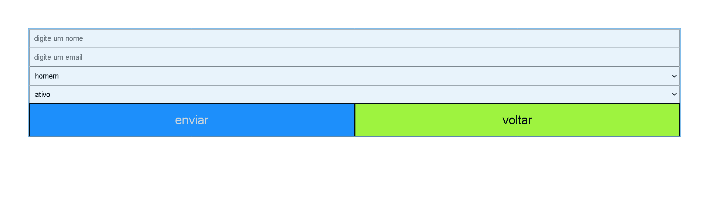

# test_frontend_atos_capital

teste de frontend sem utilização de nenhuma biblioteca ou framework 

ao carregar a pagina o windows.onload chama a função que retorna os usuarios da api gorest, 
e faz um mapeamente na tabela, criando todos os elementos html manualmente, ao clicar no buttão editar ele verifica se os valores foram alterados 

se sim ele atualiza no banco, se não, atualiza apenas na tabela 

ao clicar no edit o table muda para input e vice-versa, queria te caprichado mais, na componetização, validação de valores 
vi o email com teste de ultima hora, então tive pressa 

ao clicar em novo registro e fazer post, ele tem 2 validadores de campo, email e nome, com regex para o email, alem do select com gender e status 

em cada metodo, como post, delete, update, é exibido uma mensagem dependendo do status recebido, como sucesso, falha, etc 

 

